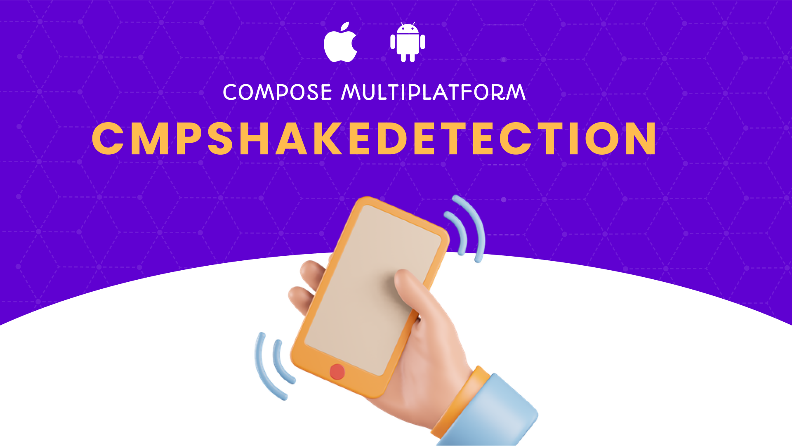

# Compose Multiplatform Shake Detection

CMPShakeDetection is a powerful library designed to bring shake detection capabilities to your Compose Multiplatform applications. Whether you're looking to add fun interactions, hidden features, or intuitive controls, CMPShakeDetection makes it easy to implement shake detection across Android and iOS platforms.



## Features
**Cross-Platform:** Works seamlessly with Compose Multiplatform.

**Easy Integration:** Simple setup and usage.

**Highly Customizable:** Define custom actions on shake events.

**Lightweight:** Minimal impact on app performance.

## Installation

Add the following dependency to your `build.gradle.kts` file:

```kotlin
commonMain.dependencies {
    implementation("network.chaintech:compose-multiplatform-shake-detection:1.0.0")
}
```
### iOS Setup
Add the following key to your Info.plist to request permission for motion data:

```kotlin
<key>NSMotionUsageDescription</key>
<string>This app uses motion data to detect shakes.</string>
```
## Usage

**Initialize the Shake Detector**

Create an instance of ShakeDetector in your shared code using rememberShakeDetector():

```kotlin
val shakeDetector = rememberShakeDetector()
```

**Start Detecting Shakes**

Start detecting shakes in a LaunchedEffect block:

```kotlin
LaunchedEffect(Unit) {
    shakeDetector.start()
}
```

**Handle Shake Events**

Use the onShake callback to define what happens when a shake is detected:

```kotlin
shakeDetector.onShake {
    // Handle Shake Event
}
```

**Stop Detecting Shakes**

Ensure that shake detection is stopped when the Composable is disposed by using DisposableEffect:

```kotlin
DisposableEffect(Unit) {
    onDispose {
        shakeDetector.stop()
    }
}
```
## Sample Example


```kotlin
@Composable
fun SpinWheel()  {
    var isSpinning = false
    val shakeDetector = rememberShakeDetector()
    // Start detecting shakes
    LaunchedEffect(Unit) {
        shakeDetector.start()
    }
    shakeDetector.onShake {
        if(!isSpinning) {
            isSpinning = true
            spinState.launchInfinite()

            MainScope().launch {
                delay(timeMillis = Random.nextLong(5000, 9000))
                spinState.stoppingWheel(Random.nextInt(0, 6))
                isSpinning = false
            }
        }
    }

    // Stop detecting shakes when the composable is disposed
    DisposableEffect(Unit) {
        onDispose {
            shakeDetector.stop()
        }
    }

    Box(
        modifier = Modifier
            .fillMaxSize()
    ) {
        Image(
            modifier = Modifier.fillMaxSize(),
            painter = painterResource(Res.drawable.icn_background),
            contentScale = ContentScale.FillBounds,
            contentDescription = null,
        )

        Column(
            modifier = Modifier
                .fillMaxSize()
                .windowInsetsPadding(WindowInsets.safeDrawing),
            horizontalAlignment = Alignment.CenterHorizontally
        ) {
            Spacer(modifier = Modifier.size(50.dp))

            Image(
                modifier = Modifier.width(303.dp).height(144.dp),
                painter = painterResource(Res.drawable.icn_jackpot),
                contentScale = ContentScale.Crop,
                contentDescription = null,
            )

            Spacer(modifier = Modifier.size(30.dp))

            Box(
                modifier = Modifier
                    .fillMaxWidth()
                    .padding(horizontal = 30.dp)
                    .aspectRatio(1f)
            ) {
                SpinWheelComponent(spinState)
            }
            Spacer(modifier = Modifier.size(20.dp))
        }
    }
}
```


## Detailed Explanation
- For a detailed explanation and a comprehensive guide, please read the [Medium blog post.](https://medium.com/mobile-innovation-network/shake-it-up-with-cmpshakedetection-integrating-fun-in-compose-multiplatform-79bc360c11e7)
- Followus On [Linkedin](https://www.linkedin.com/showcase/mobile-innovation-network)
